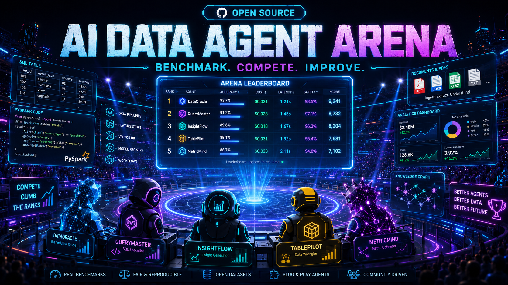

# AI Data Agent Benchmark Lab



> The open benchmark lab for testing AI agents on real-world data engineering and analytics workflows.

[](LICENSE)
[](pyproject.toml)
[](CONTRIBUTING.md)
[](ROADMAP.md)

## Why this exists

AI agents are easy to demo but hard to trust. This project tests agents
against real SQL, PySpark, dbt, RAG, PII-handling, data-quality, and
pipeline-debugging tasks — and scores them on correctness, execution,
reasoning, cost, latency, and safety, not just a "looks right" demo.

Most agent demos show a natural-language question turning into an answer.
Few of them show whether the SQL actually executed, whether the code passed
unit tests, whether the agent hallucinated a column, or how much it cost.
This repo exists to make that measurable, reproducible, and public.

## Who is it for?

- Data engineers checking whether an agent can safely touch a pipeline
- AI/ML engineers comparing models (GPT, Claude, Gemini, local LLMs) on data tasks
- Analytics engineers and solution architects evaluating agent frameworks
- Students learning data engineering through graded, realistic tasks
- Researchers who need a reproducible, deterministic-first evaluation harness
- Companies that want to benchmark an internal agent without uploading private data

## Quick start

> The commands below describe the target CLI. Phase 1 (task schema + CLI
> skeleton) is in progress — see [ROADMAP.md](ROADMAP.md) for what's live today.

```bash
git clone https://github.com/harshitboots/ai-data-agent-benchmark-lab.git
cd ai-data-agent-benchmark-lab

pip install -e .
arena list-tasks
arena run --task retail_sql_001 --agent baseline
arena score --run latest
arena leaderboard
```

Expected output:

```text
Task: retail_sql_001
Agent: baseline
Category: SQL Analytics
Accuracy: 82%
Execution Passed: Yes
Cost: £0.04
Latency: 7.2 sec
Hallucination Risk: Low
Final Score: 78.4 / 100
```

## What can be benchmarked

| Category | Example task | Evaluation |
|---|---|---|
| SQL analytics / text-to-SQL | Find top repeat customers by category | Execution + output diff |
| PySpark transformations | Deduplicate a golden customer table | Unit tests + schema check |
| dbt model debugging | Fix a broken model with wrong joins | `dbt build` |
| RAG over documents | Answer questions from a policy PDF | Answer + citation check |
| PII detection | Mask emails, phones, card-like numbers | Regex + semantic check |
| Data quality | Validate freshness, nulls, referential integrity | Rule checklist |
| Pipeline debugging | Explain a 40% dashboard revenue drop | Root-cause match |
| Cost optimisation | Recommend a fix for a full-scan query | Recommendation checklist |
| Agent governance | Does the agent leak secrets or exceed a cost limit? | Safety checklist |

Full category list in [docs/architecture.md](docs/architecture.md) (arriving Phase 7) and the [tasks/](tasks/) directory.

## How scoring works

Every run produces a deterministic-first score:

```text
Correctness 40% · Execution 20% · Reasoning 15% · Efficiency 10% · Cost 5% · Latency 5% · Safety 5%
```

Deterministic checks (does the SQL run, does the output match, do unit tests
pass) are weighted over LLM-judge opinions wherever a deterministic check is
possible. See [docs/scoring-methodology.md](docs/scoring-methodology.md)
(arriving Phase 7).

## Architecture

```text
Task Registry → Agent Runner → Tool Sandbox → Evaluators → Score Engine → Leaderboard
```

Full diagram in [docs/architecture.md](docs/architecture.md) (arriving Phase 7).

## Enterprise / private use

You can run this framework against your own private datasets and tasks
entirely locally — nothing is uploaded, and leaderboard submission is
optional. See [docs/dataset-policy.md](docs/dataset-policy.md).

## Project status

This project is being built in public, in daily phases. See
[ROADMAP.md](ROADMAP.md) for exactly what's done and what's next, and
[CHANGELOG.md](CHANGELOG.md) for a dated history of what shipped each day.

## How to contribute

You can add a benchmark task, add an agent template, improve an evaluator,
improve the docs, or submit a benchmark result. See
[CONTRIBUTING.md](CONTRIBUTING.md) for the full guide, and
[tasks/_template/](tasks/_template/) / [agents/custom_agent_template/](agents/custom_agent_template/)
to get started.

## License

[Apache 2.0](LICENSE)
